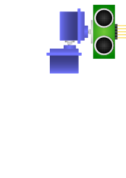

# range-radar
A aruino based radar syster for fun

## What is this about ?
Throughout the media we see cars and robots using expensive laser-based sensor to map the environment, we then tried to roll-out our own  version with items that are common to any maker's toolbox.

## Output
* Sample output, scanned my room.
	    * 

## Materials
* Hardware
  * Arduino UNO ( or compatible )
  * 2 Micro servo motors
  * A ultrassonic distance sensor
  * Jumpers, about 16 of them.
  * Protoboard
  * USB Cable
  * A Laptop
* Software
  * [Processing 3+](https://processing.org/)
  * [Arduino IDE](http://arduino.cc/)

## Assembly

## Code
1. Plug in the arduino in the computer.
2. Program the arduino with the code in [range-radar.ino](https://github.com/hydrocat/range-radar/blob/master/range-radar.ino)
3. Open up [this](https://github.com/hydrocat/range-radar/blob/master/visao_2d/sketch_171128a/sketch_171128a.pde) processing sketch.
4. Hit "run" and watch as the picture is formed

### Extra
If you so desire, you can change the resolution by altering some variables to the same value  in both range-radar.ino and the processing sketch. In the sketch, the variable is called **stepAngle**, in range-radar.ino, it's called **step**. 

## Notice
If you do not have permission to read/write to the serial port, be sure
to change it's ownership. For this, you can use the following command:

	> sudo chown <your username> /dev/tty<nameOfSerial>
	
Usually, the serial name is something along the lines of "USB0", "SO0".
Also, the file that represents the serial communication only appears when you connect the arduino.

